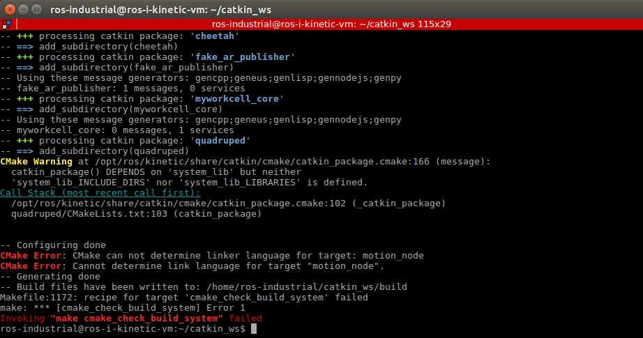

# MECA-470-Project - Quadruped
Group Luis Arevalo, Janette Calvillo Solis and Nick Lauer  
Sessions: 30  
Hours: 100  

## 1. Introduction  
The Quadruped project involved using Coppelia to recreate and adding wheels to the current mini MIT cheetah. The project also required the MIT code to be converted to ROS, and Visual Code was used to interface ROS and Coppelia. 

## 2. Design  
## 2.1 Coppelia Model  
The cheetah (Figure 1) was recreated using solidworks which allowed for proper assembly and prpvided the option ofexporting the model as URDF files that are compatible with Coppelia  
 
Figure 1. Imageof cheetah in coppelia 

# 3 Implementation 
## 3.1 Visual Studio 
Vissual Study (VS) was used to ssh into the virtual machine containing ROS for this project. The after connecting VS to the virtual machine, the file named simpleTest.py was used to test and verify VS was connecting properly to Coppelia once VS was connected to the virtual machine.  

After verifying the API interface was working, the coppelia model named, Cheetah_shaky_stabilized_rev_2.ttt was opened in Coppelia and a python file named Python_code.py stored insode the virtual machined was opned through VS. The simulation was then started in Coppelia before running the python file in VS. The python file was able to control the Coppelia model of the cheetah as shown in the video file named, video_VS - ssh-to-VM-API-Coppelia.mp4

## 3.2 Python in ROS  
The second part of the project consisted of adding a new feature to the cheetah design and controlling it using python on ROS. The team decided to add wheels to the legs of the cheetah to increase its functionality, as with wheels it will be able to move in rougher terrains and at a faster speed. The Coppelia model works correctly as all limbs are connected and joints are moving in their respective direction. The python code is functional as well and it was tested linking the Linux Virtual Environment and Coppelia Sim, through Virtual Studio Code SSH feature and API. However, a problem arose when implementing it using ROS-Kinetic, the problem consists of the "catkin_make" function not determining the linker language for the Python file containing the movement instructions. As shown in Figure 2 below, the error is inside the Cmake file for the "quadruped" package, which contains the file named "motion_node". After doing some research on the matter, it seems that the functions inside the Cmake file are mainly for C and C++ nodes, when using python extra steps are needed. After following steps found online from ROS Answers, the problem remained and no solution was found. In conclusion, the Python file and Coppelia Sim model work and can be connected and controlled by using SSH and API, the ROS implementation was unsuccessful due to the "catkin_make" not being able to determine the language of the file.) 
 

