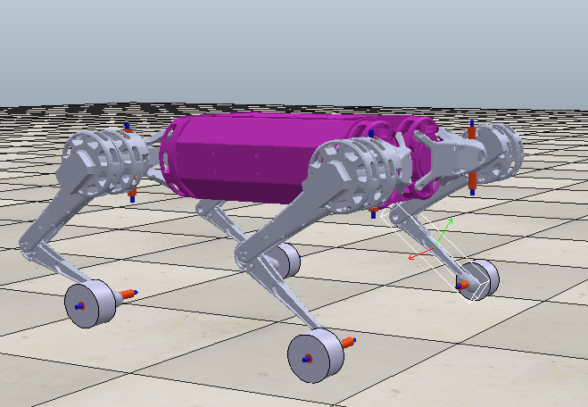
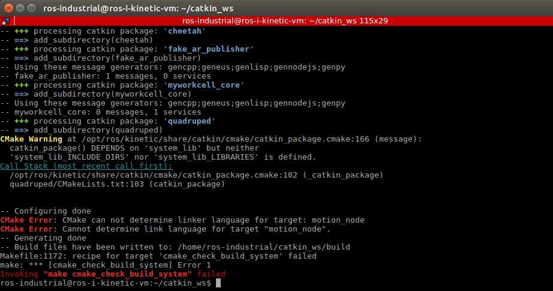
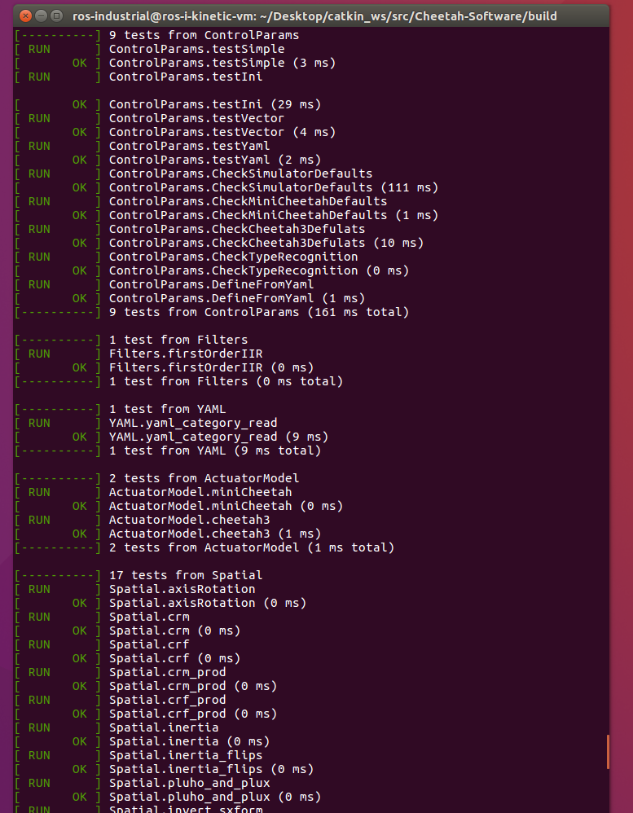
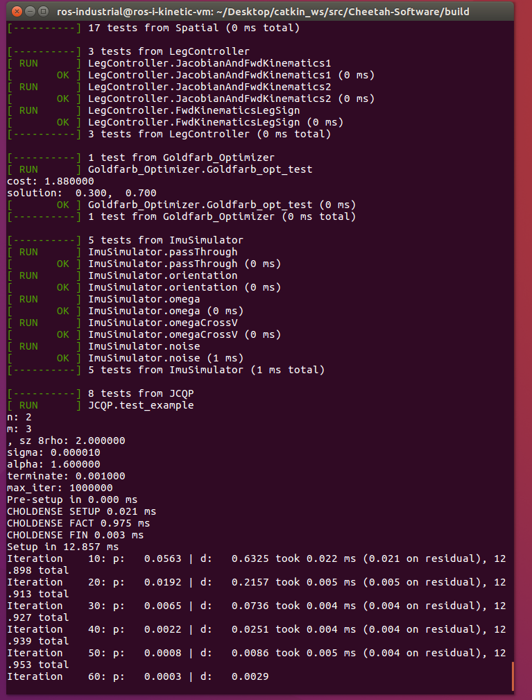
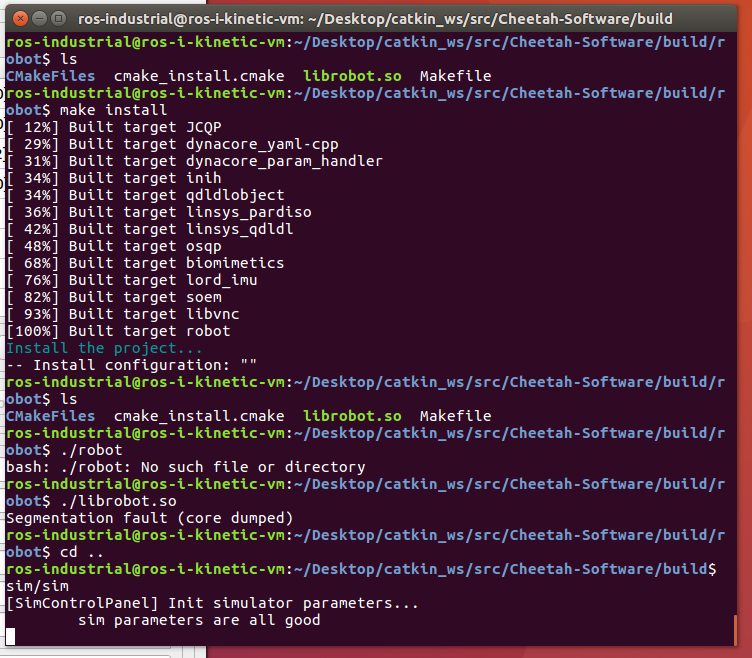
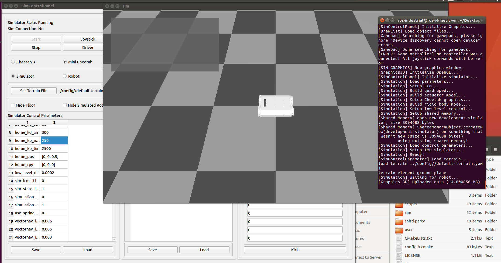

# MECA-470-Project - Quadruped
Group Luis Arevalo, Janette Calvillo Solis and Nick Lauer  
Sessions: 30  
Hours: 100  

## 1. Introduction  
The Quadruped project involved using Coppelia to recreate and adding wheels to the current mini MIT cheetah. The project also required the MIT code to be converted to ROS, and Visual Code was used to interface ROS and Coppelia. 

## 2. Design  
## 2.1 Coppelia Model  
The cheetah (Figure 1) was recreated using solidworks which allowed for proper assembly and prpvided the option ofexporting the model as URDF files that are compatible with Coppelia  
 

Figure 1. Imageof cheetah in coppelia 

# 3 Implementation 
## 3.1 Visual Studio 
Vissual Study (VS) was used to ssh into the Linux Virtual Environment containing ROS for this project. The after connecting VS to the Linux Virtual Environment, the file named simpleTest.py was used to test and verify VS was connecting properly to Coppelia once VS was connected to the virtual environment.  

After verifying the API interface was working, the Coppelia model named, Cheetah_shaky_stabilized_rev_2.ttt was opened in Coppelia and a python file named Python_code.py stored insode the virtual encironment was opned through VS. The simulation was then started in Coppelia before running the python file in VS. The python file was able to control the Coppelia model of the cheetah as shown in the video file named, video_VS - ssh-to-VM-API-Coppelia.mp4

Although the cheetah is being controlled as expected through VS, the model does not move as smoothly as expected. This is due to the model created in Solidworks and converted to URDF files.  

## 3.2 Python in ROS  
The second part of the project consisted of adding a new feature to the cheetah design and controlling it using python on ROS. The team decided to add wheels to the legs of the cheetah to increase its functionality, as with wheels it will be able to move in rougher terrains and at a faster speed. The Coppelia model works correctly as all limbs are connected and joints are moving in their respective direction. The python code is functional as well and it was tested linking the Linux Virtual Environment and Coppelia Sim, through Virtual Studio Code SSH feature and API. However, a problem arose when implementing it using ROS-Kinetic, the problem consists of the "catkin_make" function not determining the linker language for the Python file containing the movement instructions. As shown in Figure 2 below, the error is inside the Cmake file for the "quadruped" package, which contains the file named "motion_node". After doing some research on the matter, it seems that the functions inside the Cmake file are mainly for C and C++ nodes, when using python extra steps are needed. After following steps found online from ROS Answers, the problem remained and no solution was found. In conclusion, the Python file and Coppelia Sim model work and can be connected and controlled by using SSH and API, the ROS implementation was unsuccessful due to the "catkin_make" not being able to determine the language of the file. 
 
Figure 2. Image of error encountered<br?

The file contianing the code is named project_catkin_ws.zip

## 3.3 Mini-Cheetah Simulation Environment 
This section focuses on the mini-cheetah simulation environment as distributed by MIT-Biomimetics on Github. The purpose was to establish an observable baseline and a point of reference for the modifications that would be implemented. The software package and all of the required dependencies were downloaded and installed into the catkin workspace. The bugs were hunted down one-by-one, until each build could run error-free. The final build was checked against the "common library self-test" as shown in Figure 3, as seen in the figure, the test was a success.  

 

 
Figure 3. Self-test to test  

The next step was to run the simulator, however there was a problem with one of the Qt libraries. This was ultimately discovered to be a not uncommon issue, and it was resolved with a manual install of the specific directory in question. The simulation was successfully launched, howeve,r there is not much to show for the effort. The control panel comes up (Figure 4), and when the simulation is ran a floorspace and a partial build of the selected robot is rendered (Figure 5), but exercising any degree of control over its motionI was unsuccessful. It is suspected that part of the problem may lie with our underpowered computers. It is also worth noting that the mini-cheetah software was written to work with a very specific Logitech control pad, and there were numerous instances where the build process became hung-up on such details. 

 
Figure 4. Running the control panel 

 
Figure 5. Simulator 

The files containing this section of the project were too large to be uploaded in GitHub, thus, they were stored in Google Drive. The link below will direct you yo yhe dowloadable files.

https://drive.google.com/file/d/1CXyUCXnaTUgVWD4yjwqIVtd4KEj2Uwea/view?usp=sharing

# 4 Conclusion
Finally, although we suceeded in connecting the Linux Virtual Environement with Coppelia on Windows thriugh Visual Studios, and were able to cotrol the cheetah with python files in the virtual environement, we were unable to successfully execute our code using ROS. Many things were learned throughouy the course of the project and we were able to trasnaltea few of the files provided by MIT successfuly.

